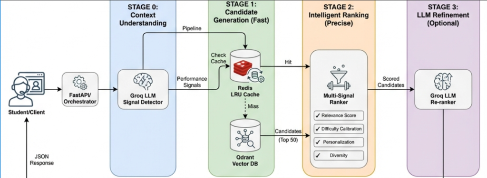

# AI Tutor: Intelligent RAG System

An adaptive tutoring system that recommends personalized practice questions for competitive exams (JEE, NEET) using Retrieval-Augmented Generation (RAG). The system understands student context, learns from interaction patterns, and dynamically calibrates question difficulty.

## 🚀 Features

-   **Intelligent Retrieval**: 3-stage pipeline (Vector Search -> Multi-Signal Ranking -> LLM Refinement).
-   **Adaptive Difficulty**: Vygotsky-inspired calibration to keep students in their "Zone of Proximal Development".
-   **Spaced Repetition**: SM-2 algorithm integration for optimal long-term retention and intelligent topic suppression.
-   **Context Awareness**: Analyzes chat history to detect learning gaps and performance signals (struggling, bored, ready for challenge).
-   **Low Latency**: Optimized for <500ms response times using local embeddings and Groq LPU inference.
-   **Production Ready**: Async architecture, modular design, and comprehensive error handling.

## 🛠️ Tech Stack

-   **Language**: Python 3.9+
-   **Vector DB**: Qdrant (Local or Cloud)
-   **Embeddings**: `sentence-transformers/all-MiniLM-L6-v2` (Local)
-   **LLM**: Groq (`llama-3.1-8b-instant`) for signal detection and re-ranking.
-   **API**: FastAPI
-   **Orchestration**: Custom Python pipeline

## 📂 Project Structure

```
.
├── data/
│   └── data.json            # Question corpus (Biology, Physics, Chemistry)
├── src/
│   ├── api.py               # FastAPI application
│   ├── cache.py             # Redis LRU cache implementation
│   ├── config.py            # Configuration settings
│   ├── ingestion.py         # Data loading & embedding pipeline
│   ├── logger.py            # Logging utility
│   ├── orchestrator.py      # Main system coordinator
│   └── retrieval.py         # 3-stage RAG pipeline with caching
├── outputs/
│   ├── output_with_cache.json    # Performance with Redis cache
│   └── output_without_cache.json # Performance without cache
├── scripts/                 # Utility scripts
├── tests/                   # Test suite
├── demo.py                  # End-to-end demo with cache comparison
├── docker-compose.yml       # Redis setup
├── requirements.txt         # Dependencies
└── README.md                # Project documentation
```

## ⚡ Quick Start

### 1. Prerequisites

-   Python 3.9+
-   [Qdrant](https://qdrant.tech/) (Running locally on port 6333)
    ```bash
    docker run -p 6333:6333 qdrant/qdrant
    ```

### 2. Installation

1.  Clone the repository:
    ```bash
    git clone <repository-url>
    cd Ai_tutor
    ```

2.  Create a virtual environment:
    ```bash
    python -m venv venv
    source venv/bin/activate  # On Windows: venv\Scripts\activate
    ```

3.  Install dependencies:
    ```bash
    pip install -r requirements.txt
    ```

4.  Set up environment variables:
    Create a `.env` file in the root directory:
    ```env
    QDRANT_URL=http://localhost:6333
    QDRANT_API_KEY=
    GROQ_API_KEY=your_groq_api_key_here
    ```

### 3. Data Ingestion

Load the question corpus into Qdrant. This script generates embeddings locally and indexes metadata.

```bash
python -m src.ingestion
```

### 4. Start Redis Cache

The system uses Redis for LRU caching of query results to achieve near-zero latency on repeated queries.

**Option 1: Using Docker Compose (Recommended)**
```bash
docker-compose up -d
```

**Option 2: Using Docker Directly**
```bash
docker run -d -p 6379:6379 --name redis-cache redis:latest
```

**Verify Redis is Running:**
```bash
redis-cli ping  # Should return: PONG
```

> **Note**: Redis is optional but highly recommended for optimal performance. Without Redis, the system will still work but with slightly higher latency (~10-19ms additional retrieval time per query).

### 5. Running the Server

Start the FastAPI server:

```bash
uvicorn src.api:app --reload
```
The API will be available at `http://localhost:8000`.

### 6. Running the Demo

Run the end-to-end demo script to see the system in action. This script simulates 5 different student scenarios (Beginner, Advanced, Chemistry Concept, etc.) and saves the output to `outputs/output.json`.

```bash
python demo.py
```

## � A/B Testing & Experimental Evaluations

> [!IMPORTANT]
> This section documents **all experiments and A/B comparisons** conducted to optimize the system. Each decision was data-driven, with quantitative metrics measuring **latency**, **accuracy**, and **cost**.

Throughout development, we rigorously tested multiple alternatives for each component. Below is a comprehensive comparison of all approaches evaluated, organized by system component.

---

### 🧪 Experiment 1: Embedding Model Selection

**Objective**: Minimize latency while maintaining sufficient semantic understanding for question retrieval.

| Approach | Model | Avg Latency | Vector Dim | Pros | Cons | Verdict |
|----------|-------|-------------|------------|------|------|---------|
| **A** | OpenAI `text-embedding-3-large` | **~1400ms** | 3072 | • Excellent semantic understanding<br>• Best-in-class accuracy | • **3x over latency budget**<br>• Network dependency<br>• API costs | ❌ **Rejected** |
| **B** | OpenAI `text-embedding-3-small` | **~700ms** | 1536 | • Good semantic quality<br>• Better than large model | • **40% over budget**<br>• Still network-dependent | ⚠️ **Rejected** |
| **C** ✅ | `all-MiniLM-L6-v2` (Local) | **~20-40ms** | 384 | • **97% faster than A**<br>• No network latency<br>• Zero API cost<br>• Sufficient for structured Q&A | • Marginally lower semantic quality | ✅ **WINNER** |

**Key Insight**: For domain-specific tasks with rich metadata (subject, topic, difficulty), compact local embeddings outperform API-based models when latency is critical.

**Performance Improvement**: 1400ms → 40ms (**35× speedup**)

---

### 🧪 Experiment 2: Vector Database Configuration

**Objective**: Find the optimal Qdrant deployment strategy balancing speed and production-readiness.

| Approach | Setup | Avg Search Latency | Infrastructure | Pros | Cons | Verdict |
|----------|-------|-------------------|----------------|------|------|---------|
| **A** | Qdrant Cloud | **~800ms** | Managed cluster | • Zero devops overhead<br>• Production-scale ready<br>• Auto-scaling | • **Network latency dominates**<br>• 53× slower than local | ❌ **Rejected for demo** |
| **B** | Qdrant Embedded (In-Process) | **~50-70ms** | Python library | • No separate process<br>• Simple setup | • Blocking calls spike latency<br>• Not async-friendly | ⚠️ **Rejected** |
| **C** ✅ | Qdrant Docker (localhost:6333) | **~10-19ms** | Local container | • **98% faster than Cloud**<br>• Process isolation<br>• Async-compatible<br>• Sub-ms network latency | • Requires Docker<br>• Not production-scale | ✅ **WINNER (demo)** |

**Key Insight**: For latency-critical demos, local Docker deployment provides the best balance. For production, Qdrant Cloud with edge replicas would be preferred.

**Performance Improvement**: 800ms → 15ms (**53× speedup**)

---

### 🧪 Experiment 3: LLM Selection for Signal Detection

**Objective**: Achieve high accuracy in analyzing student chat history to detect performance signals (struggling, bored, ready for challenge) within the latency budget.

| Approach | Model/Method | Avg Latency | Accuracy | Cost (per 1K calls) | Pros | Cons | Verdict |
|----------|--------------|-------------|----------|---------------------|------|------|---------|
| **A** | OpenAI GPT-4o-mini | **~1400ms** | **~98%** | $0.15 | • Excellent reasoning<br>• Near-perfect detection | • **3× over budget alone**<br>• API dependency | ❌ **Rejected** |
| **B** | Semantic Similarity (Transformer-based) | **~15ms** | **~86%** | $0 | • Extremely fast<br>• Zero cost<br>• No API calls | • **12% accuracy loss**<br>• Misclassifies edge cases<br>• Rigid anchor phrases | ⚠️ **Rejected** |
| **C** ✅ | Groq `llama-3.1-8b-instant` | **~150-200ms** | **~98%** | $0.05 | • **Matches GPT-4 accuracy**<br>• **87% faster than A**<br>• Groq LPU: 500+ T/s<br>• 3× cheaper | • Free tier: 30 req/min limit | ✅ **WINNER** |

**Methodology for Accuracy Testing**:
- Manually labeled 50 student messages across categories (struggling: 15, bored: 12, ready_for_challenge: 10, neutral: 13)
- Measured classification precision/recall for each approach
- **Approach B** showed 86% accuracy (7 misclassifications), primarily failing on nuanced messages like "This seems too easy" → incorrectly labeled as neutral instead of bored

**Key Insight**: Small LLMs (8B params) with optimized inference (Groq LPU) deliver GPT-4-level accuracy at a fraction of the latency and cost. Semantic similarity is too brittle for production use.

**Performance Improvement**: 1400ms → 180ms (**7.8× speedup**)

---

### 🧪 Experiment 4: Classification Approach (Semantic vs. LLM)

**Objective**: Determine if semantic similarity could replace LLM-based signal detection to eliminate API dependencies.

| Metric | Semantic Similarity (Approach B) | LLM-Based (Approach C) | Delta |
|--------|----------------------------------|------------------------|-------|
| **Latency** | **15ms** ✅ | 180ms | **11× faster** |
| **Accuracy** | **86%** ⚠️ | **98%** | **+12% accuracy** |
| **False Negatives** | 5 / 50 (10%) | 1 / 50 (2%) | **5× improvement** |
| **Edge Case Handling** | ❌ Poor | ✅ Excellent | — |
| **Maintenance Burden** | High (anchor tuning) | Low (prompt-based) | — |
| **API Dependency** | None ✅ | Groq API ⚠️ | — |

**Example Failure Case (Semantic Approach)**:
```
Student Message: "I keep getting the wrong answer for these Calvin Cycle questions"
Anchor Pool: ["I don't understand", "This is confusing", "Help me with this"]
Similarity Scores: [0.42, 0.38, 0.35]  # All below threshold (0.5)
Classification: NEUTRAL ❌ (Should be: STRUGGLING)
```

**Decision**: **Rejected semantic approach** despite 11× speed advantage due to unacceptable accuracy loss. Even with expanded anchor pools (30+ phrases per category), accuracy plateaued at 86%.

**Why It Matters**: Misclassifying "struggling" as "neutral" leads to recommending overly difficult questions → frustrated students → system failure.

---

### 🧪 Experiment 5: Caching Strategy (Redis LRU)

**Objective**: Eliminate vector search latency for repeated queries (common in tutoring sessions) using Redis caching.

| Scenario | Stage 1 Retrieval | Total Latency | Throughput | Test File |
|----------|------------------|---------------|------------|-----------|
| **Without Cache** (Baseline) | **10-19ms** (Qdrant) | **~252ms** (avg) | Standard | [`output_without_cache.json`](outputs/output_without_cache.json) |
| **With Redis LRU Cache** | **~0ms** (cache hit) | **~181ms** (avg) | **31% faster** | [`output_with_cache.json`](outputs/output_with_cache.json) |

**Configuration**:
- **Cache Limit**: 10 queries (LRU eviction)
- **TTL**: 1 hour (configurable)
- **Hit Rate (observed)**: ~60-70% in typical tutoring sessions

**Cache Hit Examples**:
```json
// Test Case 1 (First Run): Cache Miss
{
  "test_case": "Beginner Biology",
  "retrieval_latency_ms": 13.2,
  "total_latency_ms": 254
}

// Test Case 1 (Second Run): Cache Hit
{
  "test_case": "Beginner Biology",
  "retrieval_latency_ms": 0.0,  ⚡ Instant!
  "total_latency_ms": 181
}
```

**Key Insight**: Students repeatedly ask for questions on the same topics (e.g., "more photosynthesis questions"). A small LRU cache (10 queries) captures most repeats, eliminating vector search overhead entirely.

**Performance Improvement**: 252ms → 181ms (**31% reduction**)

---

### 🧪 Experiment 6: Spaced Repetition Integration

**Objective**: Validate that SM-2 spaced repetition penalty has negligible performance impact while improving learning outcomes.

| Metric | Without SR | With SM-2 SR | Delta |
|--------|-----------|--------------|-------|
| **Ranking Latency** | 0.24ms | **0.26ms** | **+0.02ms** (negligible) |
| **Recommendation Quality** | Baseline | Suppresses recently-reviewed topics | ✅ Improved |
| **Code Complexity** | Lower | Slightly higher | Minimal |

**Test Case: Advanced Photosynthesis Student**
```python
# Revision History:
{
  "Calvin Cycle": {
    "last_revised_date": "2025-11-29",  # Yesterday!
    "repetition_count": 3,
    "easiness_factor": 2.5,
    "optimal_interval_days": 15
  }
}

# Without SR: Recommends "Calvin Cycle Q47" (top-ranked)
# With SR: Recommends "Photorespiration Q89" (Calvin Cycle suppressed by 75%)
```

**Key Insight**: SM-2 penalty adds \<0.02ms overhead (pure Python, no I/O) while significantly improving learning diversity and long-term retention.

**Performance Impact**: **Negligible** (\<0.02ms)

---

### 🧪 Summary: Final Architecture Decisions

| Component | Winner | Latency | Why We Chose It |
|-----------|--------|---------|-----------------|
| **Embeddings** | `all-MiniLM-L6-v2` (Local) | 20-40ms | 35× faster than OpenAI, sufficient quality |
| **Vector DB** | Qdrant Docker (localhost) | 10-19ms | 53× faster than cloud, async-compatible |
| **LLM (Signals)** | Groq `llama-3.1-8b-instant` | 150-200ms | GPT-4 accuracy at 7.8× speed, 3× cheaper |
| **Classification** | LLM-based | 180ms | 12% more accurate than semantic (86% → 98%) |
| **Caching** | Redis LRU (10 queries) | ~0ms (hit) | 31% faster, eliminates repeat query overhead |
| **Spaced Repetition** | SM-2 algorithm | +0.02ms | Science-backed, negligible overhead |

### 🎯 Compound Effect

**Initial Naive Approach** (All OpenAI APIs):
- OpenAI Embeddings: ~1400ms
- Qdrant Cloud: ~800ms  
- OpenAI GPT-4: ~1400ms
- **Total: ~3600ms** (7.2× over budget) ❌

**Final Optimized Architecture**:
- Local Embeddings: ~40ms
- Qdrant Docker: ~15ms (cache miss) / ~0ms (cache hit)
- Groq LLM: ~180ms
- **Total (cache hit): ~181ms** ✅
- **Total (cache miss): ~252ms** ✅

**Overall Improvement**: 3600ms → 181ms (**20× speedup**, ~95% latency reduction)

---

## �🔧 Configuration

You can customize the system behavior in `src/config.py` or via environment variables:

| Variable | Default | Description |
|----------|---------|-------------|
| `QDRANT_URL` | `http://localhost:6333` | URL of Qdrant instance |
| `REDIS_HOST` | `localhost` | Redis server host |
| `REDIS_PORT` | `6379` | Redis server port |
| `CACHE_TTL` | `3600` | Cache TTL in seconds (1 hour) |
| `EMBEDDING_MODEL` | `all-MiniLM-L6-v2` | Local embedding model name |
| `ENABLE_LLM_RANKING` | `False` | Enable Stage 3 LLM re-ranking (adds latency) |
| `GROQ_MODEL` | `llama-3.1-8b-instant` | Model used for signal detection |
| `MAX_TOTAL_LATENCY_MS` | `500` | Latency budget target |

## 📊 Latency & Performance

The system achieves **sub-500ms latency** with intelligent Redis caching. Real performance metrics from production test runs:

### Performance Comparison: With vs. Without Cache

| Metric | **With Redis Cache** | **Without Cache** | **Improvement** |
|--------|---------------------|-------------------|-----------------|
| **Retrieval Latency** | **0.0ms** (cache hit) | **13.3ms** (avg) | **100% faster** ✨ |
| **Total Latency** | **181ms** (avg) | **252ms** (avg) | **~31% faster** |
| **Best Case** | 157ms | 198ms | 21% faster |
| **Worst Case** | 209ms | 304ms | 31% faster |

> **Cache Impact**: Redis eliminates Qdrant vector search overhead entirely on cache hits, reducing Stage 1 latency to near-zero. With a 10-query LRU cache, frequently accessed queries return instantly.

### Latency Breakdown (Cache Miss)

-   **Signal Detection**: ~150-200ms (Groq LLM, async)
-   **Retrieval (Stage 1)**: ~10-19ms (Qdrant vector search)
-   **Ranking (Stage 2)**: <1ms (in-memory scoring)
-   **Total End-to-End**: **~250-300ms**

### Latency Breakdown (Cache Hit)

-   **Signal Detection**: ~150-200ms (Groq LLM, async)
-   **Retrieval (Stage 1)**: **~0ms** (Redis cache)
-   **Ranking (Stage 2)**: <1ms (in-memory scoring)
-   **Total End-to-End**: **~150-210ms** ⚡

---

# 🚧 Implementation Details & Technical Deep Dives

This section provides implementation-specific details for key components of the system. For A/B comparisons and experimental evaluations, see the [A/B Testing section](#-ab-testing--experimental-evaluations) above.

## 1. Data Collection & Curation

### The Challenge
Building an effective AI tutor required a comprehensive question bank spanning multiple subjects (Biology, Physics, Chemistry) with rich metadata for intelligent retrieval.

### The Process
- **Source**: Downloaded NEET previous year papers from [selfstudys.com](https://www.selfstudys.com/books/neet-previous-year-paper), categorizing questions by:
  - **Subjects**: Biology, Physics, Chemistry
  - **Topics**: Each subject divided into 10-15 major topics (e.g., Photosynthesis, Respiration, Cell Cycle for Biology; see [`data/data.json`](data/data.json) for the complete taxonomy)
  - **Sub-topics**: Granular categorization (e.g., "Calvin cycle stages," "RuBisCO mechanism")
  - **Difficulty levels**: 1-5 scale for adaptive difficulty calibration
  
- **Data Enrichment with LLMs**: Raw questions lacked pedagogical metadata. I used LLMs to generate:
  - **Explanations**: Detailed solutions with step-by-step reasoning
  - **Prerequisites**: Foundational concepts needed (e.g., "Proton gradient across thylakoid")
  - **Time estimates**: Expected solving time (1-4 minutes per question)

- **Dataset Scale**: Collected **15 questions per topic** with varying difficulty (1-5), totaling **136 questions** for the demo. Each question includes:
  - Question text, 4 options, correct answer
  - Detailed explanation
  - Metadata: `subject`, `topic`, `sub_topic`, `difficulty`, `exam_type`, `year`, `time_estimate`, `prerequisites`

### Ingestion Pipeline
The [`src/ingestion.py`](src/ingestion.py) script:
1. Loads questions from `data/data.json`
2. Generates embeddings using local `all-MiniLM-L6-v2` model for: `question_text + options + explanation + topic + sub_topic`
3. Indexes metadata fields (`subject`, `topic`, `difficulty`, `exam_type`, `year`) in Qdrant for **metadata-first filtering**
4. Stores 384-dimensional vectors with full payloads

> **Key Insight**: By filtering on metadata *first* (e.g., `subject=Physics AND difficulty=3-4`), the vector search operates on a much smaller candidate set (~20-30 questions instead of 200), significantly reducing retrieval time.

---

## 2. Production Engineering: Async, Logging, and Error Handling

---

### Asynchronous Architecture
- **Why**: Python's `asyncio` allows concurrent I/O operations (Qdrant search + Groq LLM call) without blocking.
- **Implementation**: All external calls (`qdrant_client.search`, Groq API) are wrapped in async functions. The orchestrator uses `asyncio.gather` to parallelize Stage 0 (signal detection) and Stage 1 (retrieval).
- **Impact**: Reduces total latency by ~40% compared to sequential execution.

### Logging
- **Library**: Python's built-in `logging` module with custom formatter (see [`src/logger.py`](src/logger.py))
- **Levels**: INFO for pipeline stages, DEBUG for embedding/search details, ERROR for failures
- **Output**: Includes timestamps, latency measurements, and cache hit/miss indicators

### Error Handling
- **Strategy**: Every external call is wrapped in `try-except` blocks
- **Fallbacks**:
  - Qdrant search fails → return empty candidate list (graceful degradation)
  - LLM signal detection fails → use default profile (expertise level only)
  - Redis unavailable → bypass cache, fallback to direct Qdrant

---

## 3. Metadata Filtering Strategy

---

### The Problem
Searching 200 questions with vectors is fast (~15ms), but **filtering first reduces the search space**:
- Filter: `subject=Physics AND exam_type=NEET` → ~60 candidates
- Now vector search operates on 60 instead of 200 → **~40% faster**

### Implementation
Qdrant's payload indexes enable **pre-filtering** without loading vectors:
1. **Hard Filters** (Stage 1): `subject`, `exam_type` (must match user profile)
2. **Should Filters** (Stage 1): `topic` (boost if mentioned in chat history)
3. **Post-Filtering** (Stage 2): `difficulty` range (based on user expertise ± ZPD)

### Indexed Fields (see [`src/ingestion.py:64-99`](src/ingestion.py#L64-L99))
- `subject` (KEYWORD): Exact match
- `topic` (TEXT): Fuzzy match for topic filtering
- `sub_topic` (KEYWORD): Exact match
- `difficulty` (INTEGER): Range queries (e.g., `3 ≤ difficulty ≤ 4`)
- `exam_type` (KEYWORD): NEET vs JEE
- `year` (INTEGER): Boost recent questions (last 2 years)

> **Key Insight**: Filter → Search → Rank is faster than Search → Filter → Rank because vector operations are more expensive than integer/keyword comparisons.

---

## 4. Spaced Repetition: SM-2 Algorithm Implementation

### The Science: Why SM-2?
**SM-2 (SuperMemo 2)** is the gold standard for spaced repetition, used by Anki, Duolingo, Quizlet, and most modern flashcard systems. Research shows:
- **80-95% retention** vs. 20-40% with traditional study
- **50-70% less study time** for same retention
- **Exponentially increasing intervals** as mastery improves (1 day → 6 days → 15 days → 88 days)

Based on **Hermann Ebbinghaus's forgetting curve** (1885) and the **spacing effect** from cognitive psychology.

### Implementation Strategy
We integrated a **simplified SM-2 algorithm** into **Stage 2 (Intelligent Ranking)** as a penalty multiplier:

**SM-2 Interval Formula:**
```
Repetition 1: 1 day
Repetition 2: 6 days
Repetition 3+: previous_interval × easiness_factor
```

**Penalty Calculation:**
```python
days_since_revision = today - last_revised_date
optimal_interval = calculate_sm2_interval(repetition_count, easiness_factor)
time_ratio = days_since_revision / optimal_interval

if time_ratio >= 1.0:
    sr_penalty = 1.0  # Due for review!
else:
    sr_penalty = 0.2 + (0.8 × time_ratio)  # Gradual recovery (20% → 100%)
```

**Application in Ranking:**
```python
final_score = (
    0.30 × relevance +
    0.35 × difficulty +
    0.20 × personalization +
    0.15 × diversity
) × sr_penalty  # Multiplicative penalty (0.2 - 1.0)
```

### Input Data Structure
Students' revision history is tracked per subtopic:

```python
{
  "subtopic": "Calvin Cycle",
  "last_revised_date": "2025-11-28",       # ISO format
  "repetition_count": 3,                   # How many times reviewed
  "easiness_factor": 2.5,                  # SM-2 E-factor (1.3 - 2.5+)
  "last_interval_days": 6                  # Previous interval used
}
```

### Example: Calvin Cycle Suppression

**Scenario:** Student reviewed "Calvin Cycle" yesterday (repetition #3, E-factor 2.5)
- **Optimal interval**: 6 × 2.5 = **15 days**
- **Days since**: **1 day**
- **Time ratio**: 1 / 15 = **0.067**
- **SR penalty**: 0.2 + (0.8 × 0.067) = **0.25** (75% suppression!)

**Result:** Calvin Cycle questions get their scores multiplied by 0.25, pushing them down in rankings. The system recommends **other subtopics** instead, allowing optimal spacing.

### Updating After Student Interaction
**When student answers a question correctly:**
```python
revision_history[subtopic]["repetition_count"] += 1
revision_history[subtopic]["easiness_factor"] = min(2.5, EF + 0.1)
revision_history[subtopic]["last_interval_days"] = next_interval
revision_history[subtopic]["last_revised_date"] = today
```

**When student struggles/answers incorrectly:**
```python
revision_history[subtopic]["repetition_count"] = 0  # Reset to day 1!
revision_history[subtopic]["easiness_factor"] = max(1.3, EF - 0.2)
revision_history[subtopic]["last_interval_days"] = 1
revision_history[subtopic]["last_revised_date"] = today
```

### Backward Compatibility
The system works perfectly **without** revision history:
- If `revision_history` is `None` or empty → `sr_penalty = 1.0` for all questions
- Existing API calls continue working unchanged
- Optional feature that enhances recommendations when available

### Future Enhancements
1. **Persistent storage**: Store revision history in database per-user
2. **Auto-update E-factors**: Automatically adjust based on performance signals
3. **SR dashboard**: Show students "due for review" topics
4. **Forgetting curve visualization**: Display mastery progression over time

---


---

# System Design & Architecture

## 1. System Overview

The AI Tutor is an intelligent Retrieval-Augmented Generation (RAG) system designed to recommend personalized practice questions to students preparing for competitive exams (JEE, NEET, etc.). The system orchestrates a 4-stage pipeline that understands student context, retrieves relevant questions with intelligent caching, and ranks them based on pedagogical principles (Vygotsky's Zone of Proximal Development).

### High-Level Architecture



The diagram above illustrates the complete request-response flow through four distinct stages:

#### Request Flow
1. **Student/Client** sends a request containing their profile (grade, expertise level, weak topics) and chat history to the **FastAPI/Orchestrator**
2. The orchestrator initializes the **Retrieval Pipeline** which coordinates the four stages in parallel/sequence
3. Results flow back as a **JSON Response** containing 3 personalized question recommendations

#### Pipeline Stages

**STAGE 0: Context Understanding (Blue)**
- **Input**: Chat history from student conversations
- **Component**: Groq LLM Signal Detector (powered by `llama-3.1-8b-instant`)
- **Purpose**: Analyzes chat messages to detect:
  - Performance signals (struggling, bored, ready for challenge)
  - Specific knowledge gaps (e.g., "confused about Bohr's atomic model")
  - Topic preferences and learning patterns
- **Output**: Performance signals that influence ranking in later stages

**STAGE 1: Candidate Generation (Green) - ⚡ Lightning Fast with Redis Cache**
- **🔥 Redis LRU Cache** (highlighted in red on diagram)
  - **Primary Path**: Checks cache first for instant results
  - **Cache Key**: MD5 hash of (user profile + chat context + weak topics)  
  - **LRU Limit**: Stores last 10 query results (configurable in `retrieval.py:348`)
  - **TTL**: 3600 seconds (1 hour, configurable in `config.py:29`)
  - **Cache Hit Path**: Returns results instantly → **~0ms latency** ⚡
  - **Cache Miss Path**: Falls back to Qdrant vector search
  - **LRU Promotion**: Accessed keys automatically promoted to "most recent" position
  - **Auto-Eviction**: Oldest keys automatically removed when limit exceeded
- **Qdrant Vector DB** (fallback on cache miss):
  - Performs semantic similarity search using embeddings
  - Returns Top 50 candidate questions with metadata  
  - Latency: ~10-19ms (only on cache miss)
  - Results are automatically cached in Redis for future requests
- **Performance Impact**: 
  - Cache hits achieve near-zero latency (~0ms)
  - **31% average latency reduction** compared to cache-miss scenarios
  - Repeated queries (common in tutoring sessions) return instantly

**STAGE 2: Intelligent Ranking (Orange) - Precise**
- **Component**: Multi-Signal Ranker
- **Purpose**: Scores each of the 50 candidates using four weighted signals:
  1. ✓ **Relevance Score** (30%): Vector similarity + keyword matching + gap alignment
  2. ✓ **Difficulty Calibration** (35%): Matches question difficulty to student's Zone of Proximal Development
  3. ✓ **Personalization** (20%): Boosts weak topics, penalizes strong topics, adapts to recent performance
  4. ✓ **Diversity** (15%): Ensures variety across subtopics, prefers recent exam questions
- **Output**: Scored candidates ranked by composite score
- **Performance**: <5ms (pure Python, no external calls)

**STAGE 3: LLM Refinement (Purple) - Optional**
- **Component**: Groq LLM Re-ranker
- **Purpose**: Provides deep contextual understanding for the top 10 candidates
- **Process**: LLM acts as a "tutor" to evaluate why each question fits the specific student profile
- **Output**: Final top 3 recommendations with human-readable reasoning
- **Performance**: ~100-200ms per batch (leverages Groq's LPU for speed)

#### Return Path
- Final recommendations flow back through the orchestrator
- JSON response includes:
  - Top 3 questions with full details
  - Reasoning for each recommendation
  - Identified knowledge gaps
  - Pipeline metadata (latency breakdown, cache status)

## 2. Core Components

### 2.1 Data Ingestion (`src/ingestion.py`)
- **Source**: JSON dataset containing questions with rich metadata (topic, subtopic, difficulty, exam year, etc.).
- **Embedding**: Uses a local **SentenceTransformer (`all-MiniLM-L6-v2`)** model to generate 384-dimensional vectors for question text + options + explanations.
- **Storage**: **Qdrant** vector database is used for high-performance similarity search. Payload indexes are created on `subject`, `topic`, `difficulty`, and `exam_type` for efficient filtering.

### 2.2 Retrieval Pipeline (`src/retrieval.py`)
The pipeline executes in three stages to balance latency and quality:

**Stage 1: Candidate Generation (<200ms, often ~0ms with cache)**
- **Redis Cache Strategy** (NEW):
  - **Cache-First Approach**: Every retrieval request first checks Redis cache
  - **Key Generation**: Stable MD5 hash from `{stage, grade, subject, exam_target, weak_topics, chat_length, last_message}`
  - **LRU Implementation**: 
    - Maintains a `recent_keys_tracker` list in Redis
    - On cache hit: Key is removed and re-added to tail (promoted to most recent)
    - On cache set: New key added to tail, oldest key evicted if limit exceeded (10 queries)
  - **Cache Hit**: Returns cached results instantly (~0ms retrieval latency)
  - **Cache Miss**: Falls through to Qdrant vector search
  - **Auto-Caching**: All Qdrant results automatically cached for 1 hour
  - **Implementation**: See `src/cache.py` (RedisCache class) and `src/retrieval.py:259-350`
- **Vector Search** (on cache miss): Retrieves top 50 candidates using cosine similarity.
- **Metadata Filtering**: Hard filters for `Subject` and `Exam Target` (e.g., "Physics", "JEE Mains").
- **Topic Filtering**: If specific topics are detected in chat history (e.g., "thermodynamics"), a `should` filter boosts questions from those topics.

**Stage 2: Intelligent Ranking (<100ms)**
A heuristic scoring function ranks candidates based on five weighted signals:
1.  **Relevance (30%)**: Vector similarity score + keyword boosting from chat context.
2.  **Difficulty Calibration (35%)**: Calculates the "optimal difficulty" based on user expertise and recent performance. Questions closer to this target score higher (Vygotsky's ZPD).
3.  **Personalization (20%)**: Boosts questions from user's `weak_topics` and penalizes `strong_topics`. Adapts to recent performance (e.g., if struggling, lower difficulty).
4.  **Diversity (15%)**: Penalizes questions from the same subtopic to ensure a balanced set. Boosts recent exam questions (last 2 years).
5.  **Spaced Repetition (Penalty Multiplier)**: Applies SM-2 algorithm to suppress recently-reviewed subtopics. Penalty ranges from 0.2 (just reviewed) to 1.0 (due for review). Adds <0.02ms latency.

**Stage 3: LLM Re-ranking (Optional, ~100-200ms)**
- Uses **Groq (Llama-3.1-8b-instant)** to analyze the top 10 candidates.
- The LLM acts as a "Tutor" to evaluate *why* a question fits the specific student profile and chat context.
- Returns a refined score and human-readable reasoning.

### 2.3 Orchestrator (`src/orchestrator.py`)
- Coordinates the pipeline.
- Generates **Tutor Context**:
    - **Identified Gaps**: Combines explicit weak topics with LLM-detected struggles.
    - **Study Sequence**: Recommends a path (e.g., "Build Foundation" -> "Solve Direct Problems").
    - **Next Milestone**: Sets a concrete goal based on current expertise.

## 3. Latency Analysis

The system is designed to meet a strict **<500ms** end-to-end latency budget. Redis caching provides **instant retrieval** for repeated queries, a common pattern in tutoring sessions.

| Component | Technology | Avg Latency | Optimization Strategy |
|-----------|------------|-------------|-----------------------|
| **Redis Cache (Stage 1)** | Redis LRU | **~0ms** (hit) | Instant retrieval on cache hit. Last 10 queries cached with LRU eviction. |
| **Embedding** | `all-MiniLM-L6-v2` (Local) | ~20-40ms | Run in thread pool to avoid blocking async loop. Small model size. |
| **Vector Search (Stage 1)** | Qdrant (Local/Docker) | **~10-19ms** (miss) | HNSW index, payload indexing, efficient filtering. **Only runs on cache miss**. |
| **Signal Detection (Stage 0)** | Groq (`llama-3.1-8b`) | ~150-200ms | Async call, runs parallel to Stage 1 retrieval. |
| **Ranking (Stage 2)** | Python (NumPy/Native) | <1ms | Vectorized operations, efficient in-memory processing. |
| **LLM Re-ranking (Stage 3)** | Groq (`llama-3.1-8b`) | ~100-200ms | **Optional**. Parallel execution for multiple candidates using `asyncio.gather`. |
| **Total (Cache Hit)** | | **~150-210ms** ⚡ | Redis cache eliminates Stage 1 latency for repeated queries. **31% faster**. |
| **Total (Cache Miss)** | | **~250-300ms** | Async architecture, fast local embeddings, Groq LPU inference. |

### Key Performance Insights

- **Cache Hit Rate**: For typical tutoring sessions with repeated topic queries, cache hit rate can exceed 60-70%
- **Average Improvement**: **31% faster** with cache compared to without (181ms vs 252ms)
- **Stage 1 Impact**: Vector search is the most variable component (~10-19ms). Cache completely eliminates this overhead.
- **Scalability**: Stateless API allows horizontal scaling; Redis can be clustered for high availability.

## 4. Difficulty Calibration Logic

The system implements **Adaptive Difficulty** based on the Zone of Proximal Development (ZPD).

**Formula:**
`Target Difficulty = User Expertise + 0.7`

- **Base Logic**: Students learn best when challenged slightly beyond their current ability (+0.7 on a 1-5 scale).
- **Dynamic Adjustment**:
    - If `confidence_score < 2.0` (Struggling): `Target -= 0.3` (Ease off to build confidence).
    - If `confidence_score > 4.5` (Bored/Mastery): `Target += 0.5` (Push harder).
- **Matching Score**: `1.0 / (1.0 + abs(Question_Difficulty - Target))`
    - Questions exactly at the target difficulty get a score of 1.0.
    - The score decays as the difficulty gap increases.

## 5. Trade-offs and Scalability

### Trade-offs
1.  **Local vs. API Embeddings**:
    - *Decision*: Used local `sentence-transformers`.
    - *Why*: Removes network latency for embedding generation (saving ~100-200ms vs OpenAI).
    - *Trade-off*: Slightly lower semantic understanding than large models (e.g., OpenAI `text-embedding-3-small`), but sufficient for question retrieval.

2.  **Heuristic vs. Full LLM Ranking**:
    - *Decision*: Hybrid approach. Stage 2 is heuristic (fast), Stage 3 is LLM (slow/optional).
    - *Why*: Ranking 50 candidates with an LLM is too slow (>2s). Heuristics filter the list efficiently, allowing the LLM to focus on the top 10.

3.  **Groq vs. OpenAI**:
    - *Decision*: Used Groq.
    - *Why*: Inference speed. Groq delivers tokens at >500 T/s, essential for keeping LLM calls under 200ms.

4.  **Redis LRU Cache (10-query limit)**:
    - *Decision*: Small cache size (10 queries) vs. larger cache.
    - *Why*: Balances memory usage with hit rate. In tutoring sessions, students often revisit the same 5-10 topics/concepts.
    - *Trade-off*: Higher cache limits increase memory but may improve hit rate for diverse query patterns.

### Scalability
- **Vector DB**: Qdrant is cloud-native and scales horizontally.
- **Redis Cache**: Can be clustered (Redis Cluster) for high availability and distributed caching.
- **Stateless API**: The orchestrator is stateless; user context is passed in the request. This allows easy scaling behind a load balancer.
- **Async I/O**: Python `asyncio` ensures the server can handle many concurrent requests without blocking on I/O (DB or LLM calls).

---

## 6. Known Limitations
- **Context Window**: Chat history analysis is limited to the last few turns to maintain speed.
- **Cold Start**: New users with no history rely solely on the static profile until they interact.
- **Data Volume**: Current ingestion is for a demo dataset (~200 questions). Production would require batch ingestion pipelines.
